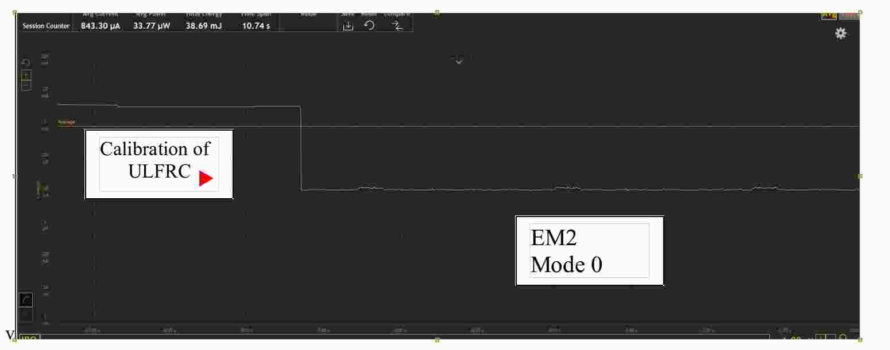
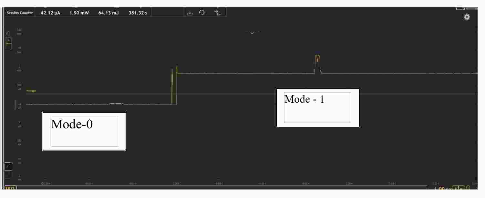

# IoT-Low-Power-BLE-I2C-UART-SPI
# Working Video --- https://drive.google.com/open?id=0B965WtzIU_oqak1JdkJpbEMtUEk
# This project is built on a starter kit --- Leopard kit 
# Software -- Simiplicity Studio 

